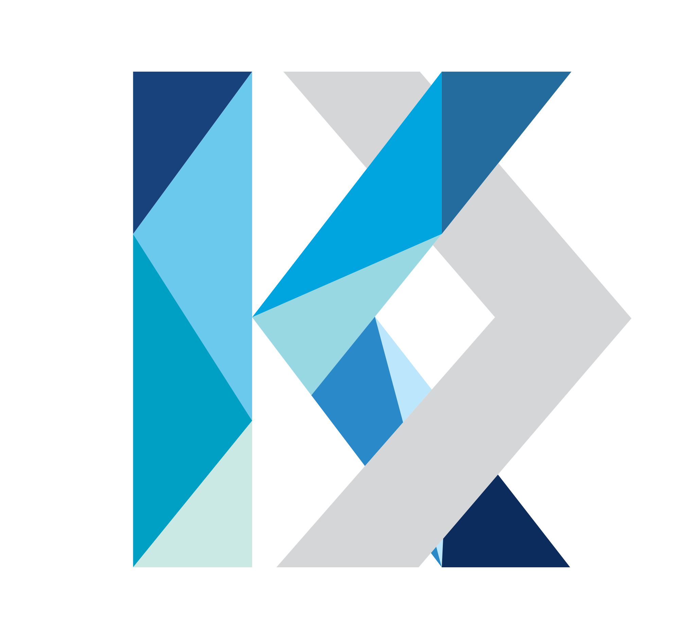
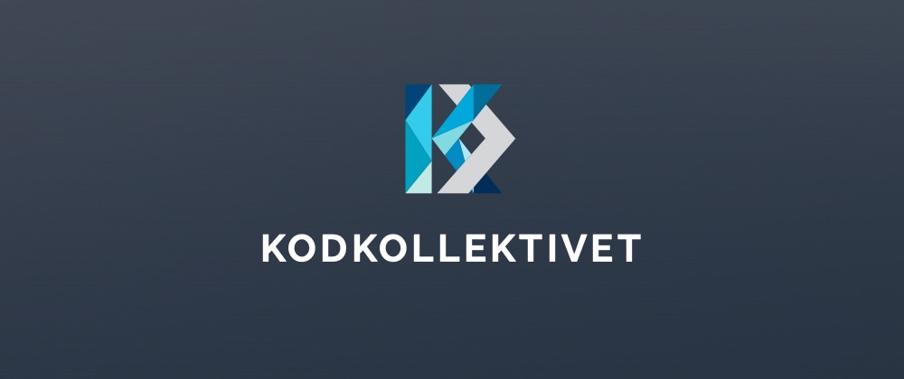

#  Kodkollektivet 3.0

### Kodkollektivet.se front & back.

Kodkollektivet is an IT student organization of Linnaeus University (Sweden).
 
 

## Main focus

The website:
- Provides information about:
  - the organization
  - current, past and future projects
  - ongoing, past and future events
  - organisation memebers
 
 

 ## Acknowledgements
 
Powered by PHP 7.4, Laravel and the sheer lunacy of <a href="https://github.com/confidentlyDumb" target="_blank">Aleksandra Bušure</a>.